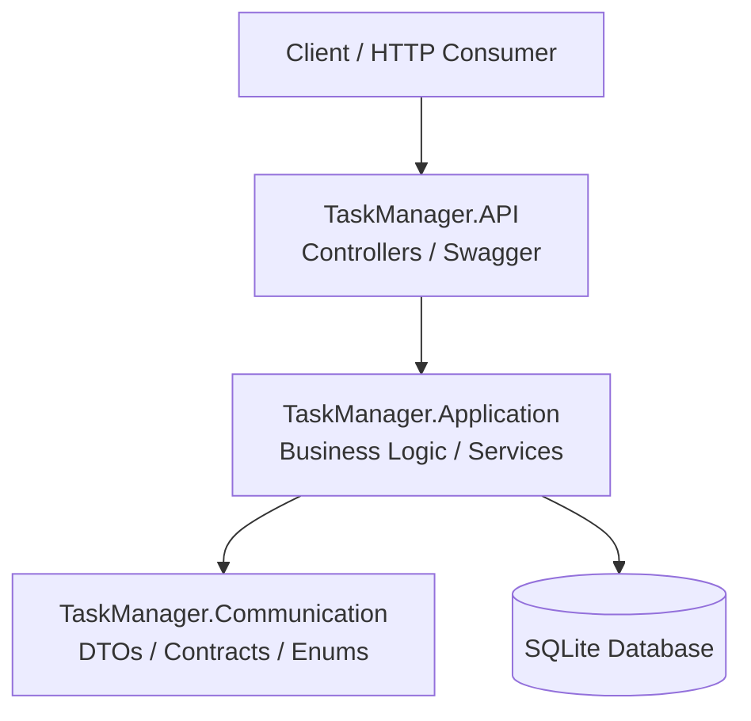

# 🗂️ TaskManager API

A simple RESTful API built with **C# .NET** to demonstrate layered architecture, separation of concerns, and basic business rule validation.

The API provides task management features such as creation, retrieval, update, and deletion.

---

## 🚀 Tech Stack

- .NET / ASP.NET Web API  
- C#  
- SQLite  
- Swagger / OpenAPI  

---

## 🧱 Project Structure

The solution follows a layered architecture:


TaskManager



- **API Layer** → Handles HTTP requests & responses  
- **Application Layer** → Contains business rules & validations  
- **Communication Layer** → Defines request/response models  

---

## 🗃️ Persistence

The application uses **SQLite** for lightweight, file-based storage with no external dependencies.

---

## ✅ Features

- Create a task  
- List all tasks  
- Get task by ID  
- Update task  
- Delete task  

---

## 📌 Business Rules

- `name` is required (max 100 chars)  
- `description` is optional (max 500 chars)  
- `dueDate` cannot be in the past  
- `priority`: `high`, `medium`, `low`  
- `status`: `pending`, `inProgress`, `completed`  

---

## 🔗 Endpoints

| Method | Endpoint        | Description        |
|--------|------------------|--------------------|
| POST   | /api/tasks       | Create task        |
| GET    | /api/tasks       | List tasks         |
| GET    | /api/tasks/{id}  | Get task by ID     |
| PUT    | /api/tasks/{id}  | Update task        |
| DELETE | /api/tasks/{id}  | Delete task        |

---

## ▶️ Running the Project

```bash
dotnet restore
dotnet run --project TaskManager.API
```

Swagger UI:

```bash
https://localhost:<port>/swagger
```

## 🎯 Purpose

This project is intended for learning and portfolio demonstration, focusing on:

Layered architecture

Clean separation of concerns

RESTful API design

Business rule validation
